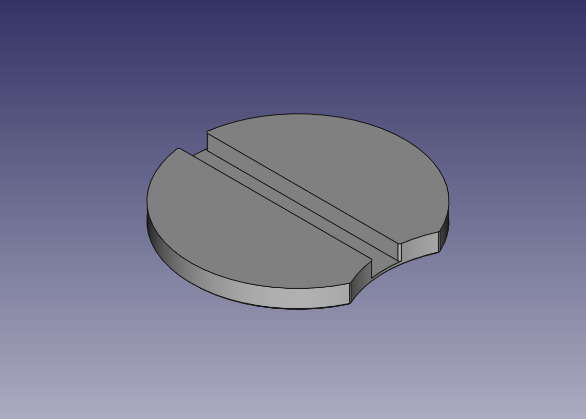

# Bottle Lighting

A 3D model for bottle lighting.



## Requirements

- FreeCAD
- BSD make (optional, not GNU make)

## Usage

To export the object(s) to STL file:

```console
PYTHONPATH=/usr/local/FreeCAD/lib python3 export-stl.FCMacro ${FILENAME_WITHOUT_EXTENSION}.stl
```

where `PYTHONPATH` should be path to FreeCAD python library directory, and
`FILENAME_WITHOUT_EXTENSION` is the file name of `FCStd` file without
extension.

Or use [`Makefile`](Makefile):

```console
make
```

## Tips

Small layer height does not make difference a lot. 0.2 mm should be fine.

## License

ISC. See [LICENSE](LICENSE).
